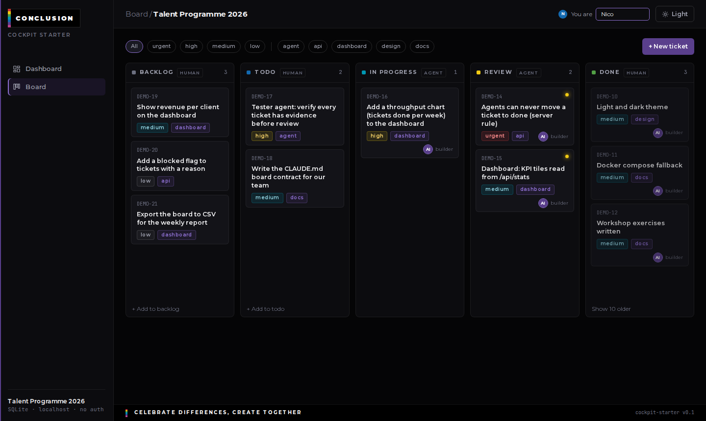
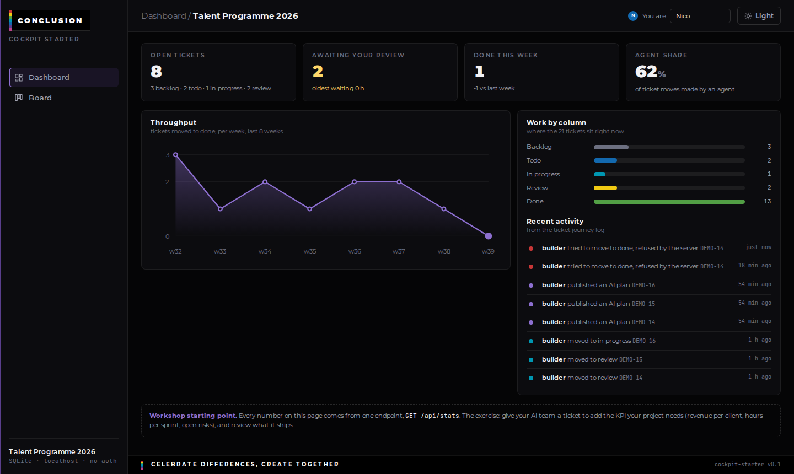

# Cockpit Starter

A small command board for an AI-assisted project team, in the Conclusion cockpit look.
Kanban with an enforced lifecycle, a dashboard that reads from it, and a contract your
AI agents follow. Built as the hands-on kit for the *AI in projectwerk* training.





## Run it

```bash
npm install
npm run dev
```

Open http://localhost:3000. The database is created and seeded on first start.
No accounts, nothing leaves your machine.

Prefer Docker? `docker compose up --build`, same URL.

## What is in the box

| | |
|---|---|
| **Board** | `backlog -> todo -> in_progress -> review -> done`, drag and drop, filters |
| **Ticket** | Request (human) · AI Plan (agent, before code) · Result (verdict + evidence) · Journey (every move, with actor) · Comments |
| **Dashboard** | open work, review queue, throughput per week, agent share, activity feed, all from `GET /api/stats` |
| **The rule** | an agent can never move a ticket to `done`; the server refuses and logs it |
| **API** | plain REST, `docs/api.md`, addressable by ref (`DEMO-7`) |
| **Agent contract** | `CLAUDE.md`, read by Claude Code on every session |
| **Example agents** | `.claude/agents/project-manager.md` (talks to you, writes tickets) and `.claude/agents/builder.md` (works one ticket) |
| **Workshop** | in the app under *Oefening instructie* (Dutch), and `docs/workshop.md` |

Stack: Next.js 16, React 19, Drizzle, SQLite via `@libsql/client` (no native build step), Tailwind v4.
Dark by default, light mode in the top bar.

## Make it yours

- `.env.local`: `PROJECT_NAME` and `TICKET_PREFIX`
- `src/lib/kanban.ts` `getStats()`: add your own numbers, they show up in `/api/stats`
- `src/app/page.tsx`: put them on the dashboard
- `.claude/agents/`: add roles to your team

## Reset

Stop the server and delete `data/cockpit.db`. Next start reseeds the demo board.
